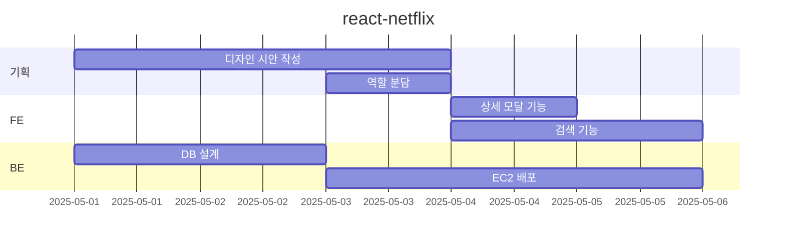

# 🎬 **Netflix 클론 프로젝트**

---

## 📄 프로젝트 개요

**목표**

넷플릭스 UI를 모티브로 다양한 영화/TV 콘텐츠를 보여주고, 상세 모달 및 마이리스트 기능을 구현하여 React 기반 프론트엔드 개발 실무 감각을 키우는 것이 목적입니다.

**기술 스택**

`React`, `JavaScript`, `Vite`,`CSS`, `react-router-dom`,`husky`,`Swiper`, `TMDB API`

**작업 해상도 기준**

`375 x 780px` (모바일 기준), 반응형

---

## WBS


___

## 🗂️ 폴더 구조

```
react-netflix/
├── .github/
├── .husky/
├── src/
│   ├── assets/
│   │   ├── icon-btn.svg
│   │   └── icon-home.svg
│   ├── components/
│   │   ├── Banner/
│   │   │    ├── Banner.css
│   │   │    └── Banner.jsx
│   │   ├── DetailModal/
│   │   └── Feed/
│   ├── context/
│   │   └── MyListContext.jsx
│   ├── hooks/
│   │   └── useContentData.js
│   ├── layouts/
│   │   ├── MainLayout.css
│   │   └── MainLayout.jsx
│   ├── pages/
│   │   ├── Category/
│   │   │    ├── Category.css
│   │   │    └── Category.jsx
│   │   ├── CommingSoon/
│   │   ├── Genre/
│   ├── routes/
│   │   └── AppRoutes.jsx
│   ├── services/
│   │   ├── api.js
│   │   └── requests.js
│   ├── App.jsx
│   ├── main.jsx
├── .prettierrc, eslint.config.js 등
└── README.md

```

---

## 🧑‍💻 협업 방식 및 Git 전략

- 기능별 담당자 지정 (예: Banner, Row, DetailModal 등)
- 브랜치 전략:
    - `main`: 배포용
    - `dev`: 통합 브랜치
    - `feature/*`: 기능 단위 브랜치
    - `refactor/*`: 기능 리팩토링 브랜치
    - `fix/*`: 기능 수정 븐랜치
- PR 기반 협업: `feature,fix,refactor → dev → main` 병합 순서
- 코드 리뷰 및 리팩토링 공유

---

## 📐 코드 스타일 및 커밋 컨벤션

### ✨ 코드 스타일 가이드

- **인덴트**: Space 2칸
- **줄 끝 문자**: LF (Line Feed)
- **파일 끝 개행**: 항상 추가
- **포맷 도구**: `Prettier`, `ESLint`, `EditorConfig`
- **저장 시 자동 포맷**: VSCode 설정 사용 (`formatOnSave: true`)

### 📁 관련 설정 파일

```
.eslint.config.js
.prettierrc
.eslintrc
```

---

### 🧪 커밋 검사 자동화 (Husky + CommitLint)

> 커밋 메시지 규칙 검사 + 커밋 전 자동 포맷을 통해 협업 품질 유지
> 

### 📦 설치 패키지

```bash
npm install -D husky lint-staged @commitlint/{cli,config-conventional}
```

### 📂 구성 구조

```
.husky/
├── pre-commit     // 커밋 전 포맷 적용
└── commit-msg     // 커밋 메시지 검사
```

### 📜 package.json 설정 예시

```
"scripts": {
  "prepare": "husky install"
},
"lint-staged": {
  "*.{js,jsx,ts,tsx,json,css,scss,md}": [
    "prettier --write",
    "eslint --fix",
    "git add"
  ]
}
```

### 📝 commitlint.config.js

```
module.exports = {
  extends: ['@commitlint/config-conventional'],
};
```

### ✅ 커밋 메시지 컨벤션

| 태그 | 의미 | 예시 |
| --- | --- | --- |
| `feat:` | 기능 추가 | `feat: 모달 클릭 시 상세정보 조회 추가` |
| `fix:` | 버그 수정 | `fix: swiper 슬라이드 터치 오류 수정` |
| `refactor:` | 리팩토링 | `refactor: preview 스와이퍼 로직 정리` |
| `style:` | 스타일 변경 | `style: 배너 버튼 마진 조정` |
| `docs:` | 문서 수정 | `docs: README 구조 정리 및 회고 추가` |

---

## 📱 주요 페이지 구성

| 페이지 | 설명 |
| --- | --- |
| `/Category` | 사용자 프로필 선택 화면 |
| `/CommingSoon` | 출시 예정 콘텐츠 |
| `/Genre` | 장르별 콘텐츠 그리드 나열 페이지 |
| `/Home` | 배너, Row 슬라이드 등 메인 홈 |
| `/Intro` | 웹 진입 시 로딩 및 자동 전환 |
| `/Movies` | 영화 콘텐츠 카테고리별 슬라이드 나열 |
| `/TVShows` | TV 콘텐츠 카테고리별 슬라이드 나열 |
| `/MyList` | 사용자가 저장한 콘텐츠 목록 |
| `/Search` | 검색 입력창 + 자동완성 + 검색 결과 렌더링 |

---

## 🧱 핵심 기능 요약

- Swiper를 통한 슬라이드형 미리보기 구현 (터치/마우스 모두 지원)
- `useContentData`, `useDetailData` 훅으로 데이터 로직 분리
- 모달 기능: 클릭 시 상세 API 요청 및 표시
- 무한 스크롤: `IntersectionObserver` 기반 구현
- 마이리스트 추가/삭제 로컬 상태 관리 (context API)

---

## 🔧 문제 해결 기록

| 문제 | 원인 | 해결 방법 |
| --- | --- | --- |
| 모바일에서 프리뷰 슬라이드가 안 됨 | Swiper 설정 미흡, CSS 누락 | Swiper `touch-action`, `slidesPerView='auto'` 등 설정 추가 |
| 모달이 특정 Row에서만 안 열림 | props 전달 누락 | `onInfoClick` 명시적으로 전달 및 handler 작성 |
| 콘텐츠 데이터 훅 중복 존재 | 훅 분산되어 관리 어려움 | `useContentData` 하나로 통합 (`multi`, `single` 모드) |
| 슬라이드 포스터 반응형 깨짐 | `slidesPerView` 고정 수치 사용 | `slidesPerView='auto'` + CSS `width` 고정 처리 |

---

## 🧑‍💻 협업 방식

- 기능 단위 브랜치 개발 → PR 리뷰 → dev 통합 → main 병합
- 컴포넌트별 역할 분리 (Row, Banner, DetailModal 등)
- 커스텀 훅 사용 권장 (`useContentData`, `useDetailData` 등)
- 코드 리뷰: 네이밍, 재사용성, 리팩토링 포인트 공유

---

## ✨ 회고

> 넷플릭스 UI를 구성하며 React의 컴포넌트 구조화, 커스텀 훅 활용, 상태 분리 등 실무에 가까운 방식으로 구조화했습니다.
> 
> 특히 데이터를 요청하고 랜더링하기까지의 흐름, 무한 스크롤, 모달 인터페이스 처리 경험이 큰 학습이었습니다.
> 
> Swiper, IntersectionObserver, Context API 등 다양한 기술을 연동해보며 사용자 경험을 개선하는 데 집중했습니다.
> 

---

## 📎 참고 사항

- TMDB API 사용
- 모바일 해상도 기준 최적화 (`375px` 기준)
